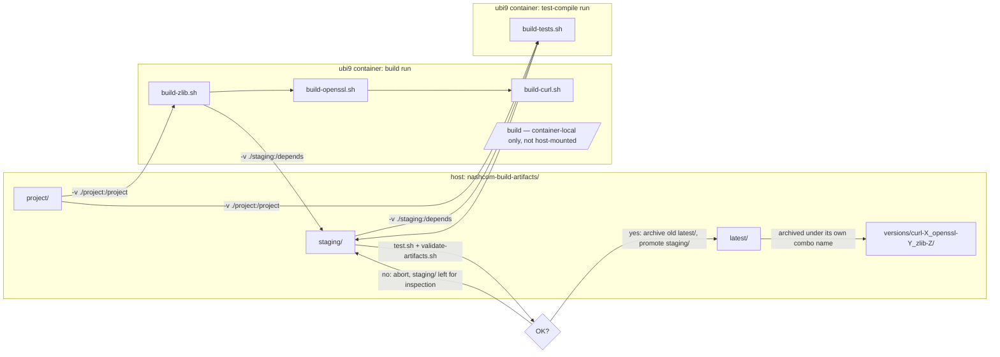

# nashcom-build-artifacts

Builds static + shared **openssl**, **libcurl**, and **zlib** in a
`registry.access.redhat.com/ubi9` container — for Domino C-API addins that
need an independent, correctly-linked HTTPS client. Dynamically linking
your own libcurl on Linux silently resolves to Domino's own bundled copy
instead of yours; see [docs/why-static-linking.md](docs/why-static-linking.md)
for the full story.

## Quickstart

```bash
./build.sh
```

Builds curl/openssl/zlib into `staging/`, compiles and runs the test
programs against it, validates the result, and — only if all of that
passes — promotes it to `latest/`. A failed build or test never touches
`latest/`; it's always the most recent build that actually passed.

```bash
./test.sh                                        # recompile + rerun the test programs against latest/, no rebuild
CURL_VERSION=8.20.0 ./build.sh                    # build a specific version (also OPENSSL_VERSION / ZLIB_VERSION)
./build.sh --clean                                # force a genuine from-scratch rebuild
./build.sh --skip-validate                        # build + promote unconditionally, skip testing
```

Everything you want ends up in `latest/`: headers + `.a`/`.so` for all
three libs, `bin/` (statically-linked test binaries), `BUILD_INFO.txt`,
and the full build/test logs. `versions/` keeps one archived snapshot per
version combo that used to be `latest/`.

## How it works



## Layout

```
Dockerfile          UBI9 + build toolchain (dnf install)
build.sh             host wrapper: build image, build into staging/, validate, promote to latest/
test.sh              standalone: compile+run project/testing/*.cpp against any target dir (default latest)
check-versions.sh    reports latest upstream curl/openssl/zlib releases vs. what's pinned (informational only)
docs/why-static-linking.md   the investigation that motivated this whole pipeline
project/             mounted at /project — build/test scripts and sources, no artifacts
  versions.env         pinned default CURL_VERSION / OPENSSL_VERSION / ZLIB_VERSION
  build.sh              in-container orchestrator: zlib -> openssl -> curl, writes BUILD_INFO.txt
  lib/build-{zlib,openssl,curl}.sh, lib/common.sh, lib/build-tests.sh
  sources/              downloaded tarballs, cached across runs (gitignored)
  testing/              test program sources (e.g. test_openssl.cpp)
testing/validate-artifacts.sh   host-side: checks .a/.so files + headers, runs CLI tools + bin/* test binaries
tools/               standalone Alpine/musl pipeline — static openssl/curl CLI binaries, not part of the UBI9 pipeline
  build.sh             builds tools/bin/openssl + tools/bin/curl from source on alpine:latest
  bin/                 output: static-pie linked, stripped binaries
staging/             mounted at /depends during a build — untested output, not yet promoted (gitignored)
latest/              the promoted, tested build — always the most recent one that passed
  bin/, openssl/, curl/, zlib/, BUILD_INFO.txt, build.log, test.log
versions/            archive of every build that used to be latest/, keyed by version combo
  curl-8.21.0_openssl-4.0.1_zlib-1.3.2/   same layout as latest/
```

## Testing

Two layers:

- **`testing/validate-artifacts.sh`** — host-side, checks the expected
  `.a`/`.so` files and headers exist, runs the `openssl`/`curl` CLI tools,
  and runs every binary under `bin/`.
- **`project/testing/*.cpp`** — actual test programs, compiled by
  `project/lib/build-tests.sh` into `bin/`, statically linked so they run
  on any Linux host with no container needed. Both link `-static`, a step
  further than the CLI tools — expect `dlopen`-based OpenSSL providers
  (`legacy`/`fips`) to report `FAILED` there even on a correct build;
  that's an inherent static-linking limitation, not a bug.
  - `test_openssl.cpp` — OpenSSL static-link smoke test: TLS connect, cert
    dump, provider load check.
  - `test_curl.cpp` — libcurl static-link smoke test (the CLI tool check
    above only proves the *dynamically*-linked `curl` binary works; this
    proves `libcurl.a` itself links and runs): prints `curl_version_info()`
    and, with a URL, does a real HTTPS GET.

  For an actual connection (i.e. running either binary with an
  address/URL argument), both resolve their CA trust store via a shared
  `FindCaBundle()` lookup: a local `cacert.pem` first (drop one next to the
  binary to override), then RHEL/UBI9, Debian/Ubuntu, and Alpine's system
  paths in turn — see the top of either `.cpp` file, or
  [docs/why-static-linking.md](docs/why-static-linking.md#ca-certificates)
  for why this can't just be one universal default.

## Incremental builds

`build.sh` skips work at two levels: if `latest/` already is the exact
version combo requested (and still validates), the whole run is a no-op.
Otherwise, each `project/lib/build-*.sh` skips reconfigure/make/install if
`staging/` already has that exact version built (a `.built-version`
marker next to its output) — handy for iterating on just one library.
`FORCE_REBUILD=1` ignores all of that; `--clean` wipes `staging/` first.

curl's marker also folds in the openssl/zlib versions it linked against,
so bumping either dependency forces a curl rebuild too.

## Source integrity

`project/versions.env` has an optional `*_SHA256` for each library. If set,
`fetch()` verifies every download (fresh or cached) against it and aborts
on a mismatch; if empty, it just logs a warning. Get the real value from
the project's own download page when you pin a version (URLs are in
`versions.env`'s comments) — `./check-versions.sh` can compute the hash of
what it downloads for convenience, but that's not the same as verifying
against the project's published checksum; cross-check it at least once.

## Standalone static CLI binaries (tools/)

The main pipeline above builds `.a`/`.so` **libraries** matched to Domino's
glibc/UBI9 ABI, for linking into C-API addins — it does not produce a
portable static `openssl`/`curl` **binary** (glibc fights that; see
"Deviations" below). `tools/build.sh` is a separate, simpler pipeline that
does exactly that instead: it builds curl + openssl from source on
`alpine:latest` (musl libc), producing genuinely static, standalone CLI
binaries with no dual static+shared/staging/validate/promote machinery —
just two binaries to look at.

```bash
./tools/build.sh
```

Shares `project/versions.env` for pinned versions/checksums with the main
pipeline (one source of truth), builds into `tools/bin/`, and skips
rebuilding a library whose binary already exists there (`rm tools/bin/curl`
to force just that one to rebuild; `docker volume rm
nashcom-alpine-static-work` to force openssl too, since its install lives in
a persistent named volume that curl's build links against).

```
tools/build.sh   builds tools/bin/openssl + tools/bin/curl from source, statically, on Alpine/musl
tools/bin/       output: static-pie linked, stripped openssl and curl binaries (~8M each)
```

## Deviations from the original build notes

- `build-curl.sh` adds `--with-zlib=/depends/zlib` (the original notes built
  zlib but never pointed curl's configure at it).
- Each library builds **both** static (`.a`) and shared (`.so`) in one
  pass. The `openssl`/`curl` CLI binaries link dynamically as a result
  (each project's default once shared is enabled) — that's out of scope
  here, not a bug to fix. This pipeline's job is the `.a`/`.so`
  **libraries**, matched to Domino's own glibc/UBI9 ABI for linking into
  C-API addins; a genuinely static, portable `openssl`/`curl` **binary**
  is a different problem (glibc fights clean static linking — see the
  `dlopen`/`getaddrinfo`/NSS warnings on `test_openssl.cpp`'s own link) and
  belongs in a separate, Alpine/musl-based pipeline — see
  [Standalone static CLI binaries (tools/)](#standalone-static-cli-binaries-tools)
  above.

## Verification

```bash
file latest/curl/lib/libcurl.a
nm latest/curl/lib/libcurl.a | grep curl_easy_init
cat latest/BUILD_INFO.txt
```
